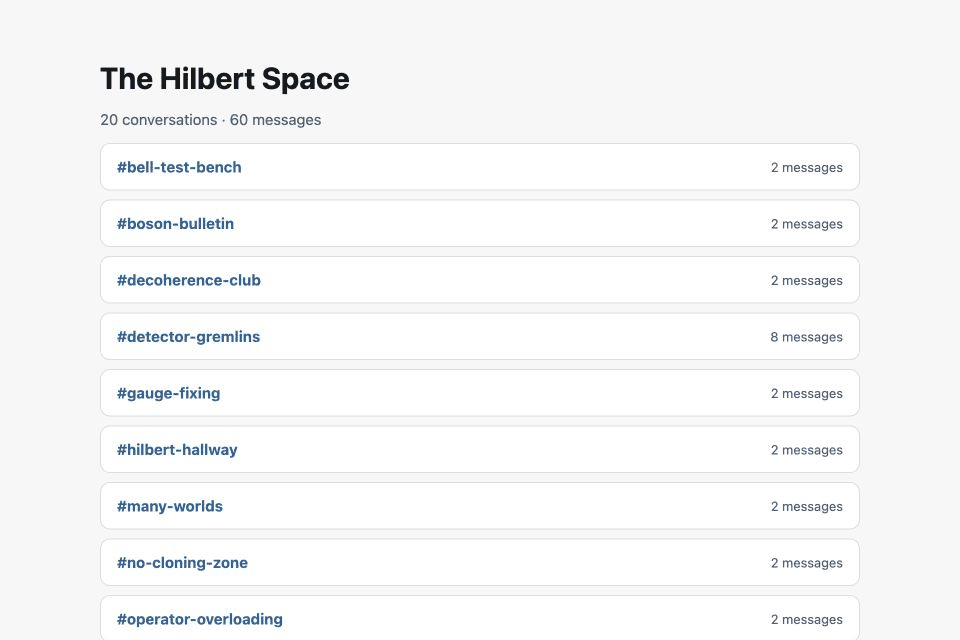

# Slack Workspace Mirror

Continuously save Slack channels, DMs, files, and future messages to a folder
on your computer. Optionally save the same content into another Slack workspace.

This is useful for keeping a backup of a Free Slack workspace,
where searchable history is limited to 90 days.



## What it saves

- Public and private channels
- DMs and group DMs
- Messages and threads
- Images and downloadable files
- Future messages, edits, and deletion status

Open `slack-archive/index.html` to browse readable chronological transcripts.
Channels, DMs, people, messages, and attachment names are searchable. Images
appear inline, other attachments are linked, and thread replies are indented.
The archive also keeps the original JSON records so nothing is lost. Runs are
resumable and do not duplicate content.

## Setup

```sh
git clone https://github.com/dhidary/slack-workspace-mirror.git
cd slack-workspace-mirror
```

### 1. Create the source Slack app

At [api.slack.com/apps](https://api.slack.com/apps), choose **Create New App**,
**From an app manifest**, and the workspace to back up. Paste the contents of
`source-app-manifest.yaml` and create the app. Under **OAuth & Permissions**,
install it to the workspace and copy its **User OAuth Token** (`xoxp-...`).

Under **Basic Information → App-Level Tokens**, generate a token with
`connections:write` and copy the resulting `xapp-...` token.

### 2. Add the tokens

```sh
cp mirror.env.example mirror.env
```

Edit `mirror.env`:

```sh
SLACK_SOURCE_USER_TOKEN='xoxp-...'
SLACK_SOURCE_APP_TOKEN='xapp-...'
SLACK_MIRROR_TARGET='local'
SLACK_ARCHIVE_DIR='./slack-archive'
```

### 3. Run it

```sh
./setup.sh
./run_mirror.sh dry-run
./run_mirror.sh once
./run_mirror.sh watch
```

`dry-run` should list the conversations it can access. `once` creates the
archive; open `slack-archive/index.html` in a browser to check it. `watch` saves
future activity and must remain running. Restart it whenever the computer
restarts.

The source token can only copy conversations accessible to its Slack user.
Messages and files that Slack has already hidden or deleted cannot be recovered.

## Optional: also save to another Slack

Create and install a second app from `destination-app-manifest.yaml`, then add
its User OAuth Token and change the target:

```sh
SLACK_DEST_USER_TOKEN='xoxp-...'
SLACK_MIRROR_TARGET='both' # use slack for Slack-only
```

Docker Compose is also supported after creating `mirror.env`:

```sh
mkdir -p slack-archive
HOST_UID=$(id -u) HOST_GID=$(id -g) docker compose up -d --build
```

The readable archive will appear in `./slack-archive`.

PRs and feature requests welcome.
